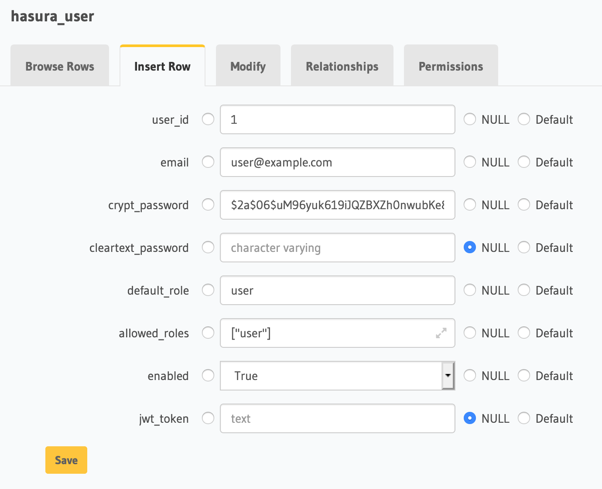
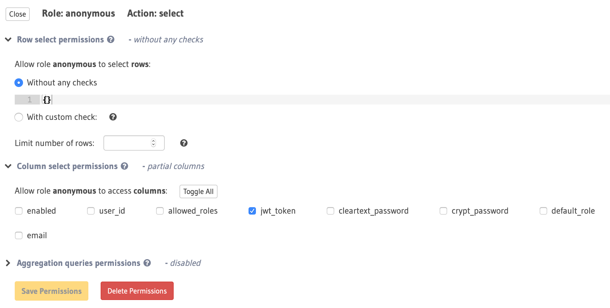
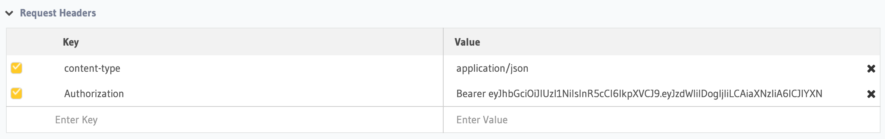

# Hasura JWT Auth

This project allows you to authenticate users from within Hasura and PostgreSQL.
User data is stored in the `hasura_user` table that encrypts cleartext passwords using a trigger.
The `hasura_auth` function can be made available for anonymous users to authenticate.
After a successful authentication the `Authorization: Bearer {jwt_token}` header can be used in subsequent GraphQL calls.

The admin can create new users in the console or using GraphQL mutations on the `hasura_user` table.

## Quickstart

The Docker [quickstart](quickstart/readme.md) initializes containers for PostgreSQL, Hasura and PgAdmin with an initial configuration for users/todos.

## Configuration

Hasura should be configured with a secret for the admin user and for signing the jwt tokens.
You can use the following snippet to generate random secrets on the command line:

```bash
python3 -c 'import secrets; print(secrets.token_urlsafe(48))'
```

Set these configuration options when starting the Hasura engine and replace the secrets with your own values:

```bash
HASURA_GRAPHQL_UNAUTHORIZED_ROLE=anonymous
HASURA_GRAPHQL_ADMIN_SECRET=adminsecret
HASURA_GRAPHQL_JWT_SECRET='{"type":"HS256","key":"jwtsecret of 32 characters or more"}'
```

The SQL function needs to know the secret to generate jwt tokens so we store it as a setting in the database:

```sql
create database example;
\connect example
create extension if not exists pgcrypto;
alter database example set "hasura.jwt_secret_key" to 'jwtsecret of 32 characters or more';
```

## Setup

Install the [pgjwt](https://github.com/michelp/pgjwt) extension or execute the [pgjwt.sql](quickstart/docker-entrypoint-initdb.d/1-pgjwt.sql) script.
This extension contains a `sign` function that does the the actual jwt signing.

Execute the [hasura-jwt-auth.sql](quickstart/docker-entrypoint-initdb.d/2-hasura-jwt-auth.sql) script and add tracking on the `hasura_user` table and the `hasura_auth` function.
An easy way to do this is by navigating to the Data tab in Hasura and use the Raw SQL form.
However this doesn't display the example jwt token as output.

Its also possible to use the `psql` client to load the script.
Make sure that you connect using the same user as Hasura, or add a `set role` and `\connect` line in the script.

## Table: hasura_user



The table `hasura_user` table contains fields for:

- user_id - serial
- email (unique) - used as username
- crypt_password - contains an encrypted password
- cleartext_password - is always cleared and only used for input
- default_roke - the default role of the user
- allowed_roles - jsonb array of allowed roles
- enabled - boolean default true
- jwt_token - is never set and only used for output

## Authentication

Set the permissions so that users with role `anonymous` are allowed to select the `hasura_user` table and allow only the `jwt_token` column.



Example authentication request:

```graphql
query {
  hasura_auth(args: {email: "user@example.com", cleartext_password: "password"}) {
    jwt_token
  }
}
```

Use the returned `jwt_token` as a header:



## Troubleshooting

Use the [jwt.io](https://jwt.io/) website to debug the contents of the generated jwt tokens check validation.
You can emulate an anonymous user session in the console by setting the `x-hasura-role: anonymous` header.

## Limitations

- No password strength is enforced.
- Tokens are set to expire after 24 hours with the `exp` claim, however you can adjust the [interval](https://github.com/sander-io/hasura-jwt-auth/blob/master/hasura-jwt-auth.sql#L52).
- Existing tokens will not invalidate when a user is disabled, however no new tokens can be generated.
- The `jwt_secret` is stored inside the database instead of a password vault.

## References

- [Authentication using JWT](https://docs.hasura.io/1.0/graphql/manual/auth/authentication/jwt.html)
- [pgjwt](https://github.com/michelp/pgjwt)

## Contributors

- [@dvasdekis](https://github.com/dvasdekis) docker quickstart
- [@sanderhahn](https://github.com/dvasdekis)
